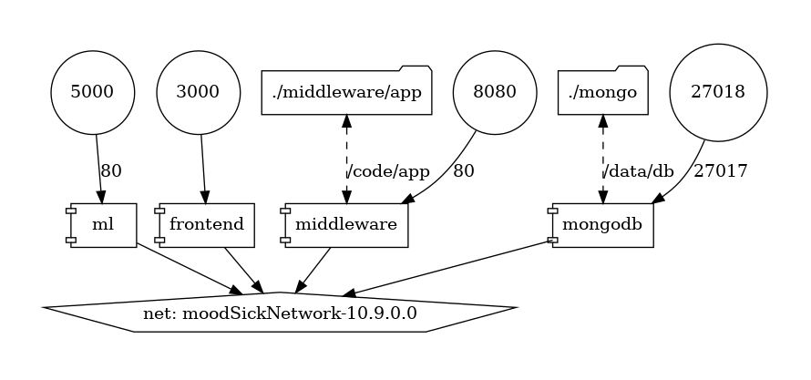

# MoodSick
A repository housing our implementation for the CIS 600 (Social Media and Data Mining) project

## Environment set-up
We are using docker to manage our environment. This will help us ensure that we will all be using the same environment and will not run into any issues with dependencies.

### Install Docker
- [Windows](https://docs.docker.com/docker-for-windows/install/)
- [Mac](https://docs.docker.com/docker-for-mac/install/)
- [Linux](https://docs.docker.com/engine/install/)

### Build the docker image
- Clone the repository
- Navigate to the docker directory:
    ```
    cd docker
    ```
- Build the docker environment:
    ```
    docker-compose build
    ```
- Run the docker environment: 
    ```
    docker-compose up
    ```

### Docker network
- The docker-compose file creates a network called ```moodSickNetwork```
- This network is used to connect all of our services together
    - Frontend : http://localhost:3000
    - Middleware : http://localhost:8080
    - Ml model : http://localhost:5000
    - Database : http://localhost:27018
- The below diagram shows the architecture of our application


### Environment Files
- The docker-compose file uses environment files to set up the environment variables
- There are two environment files
    - ```docker/middleware/.env``` : This file contains the environment variables for the Spotify API 
    ```
        SPOTIFY_CLIENT_ID,
        SPOTIFY_CLIENT_SECRET,
        SPOTIFY_USER_ID
    ```
    - ```docker/ml/.env``` : This file contains the environment variables ATLAS_URI which has the vectors used by the ML model

## Exploration
If you'd like to do some data exploration, open the notebook located at the following location:
- Initial exploration: [Initial Exploration](data_exploration/initial_exploration.ipynb)
- Mood Genere Dynamics: [Mood Genre Dynamics](data_exploration/MoodOnSpotify.ipynb)

## Contributors
<a href="https://github.com/rahulkulhalli/MoodSick/graphs/contributors">
  
</a>

## Acknowledgements
We'd like to thank the authors of the [GZTAN](https://www.kaggle.com/andradaolteanu) and the [Spotify](https://www.kaggle.com/mrmorj) datasets.